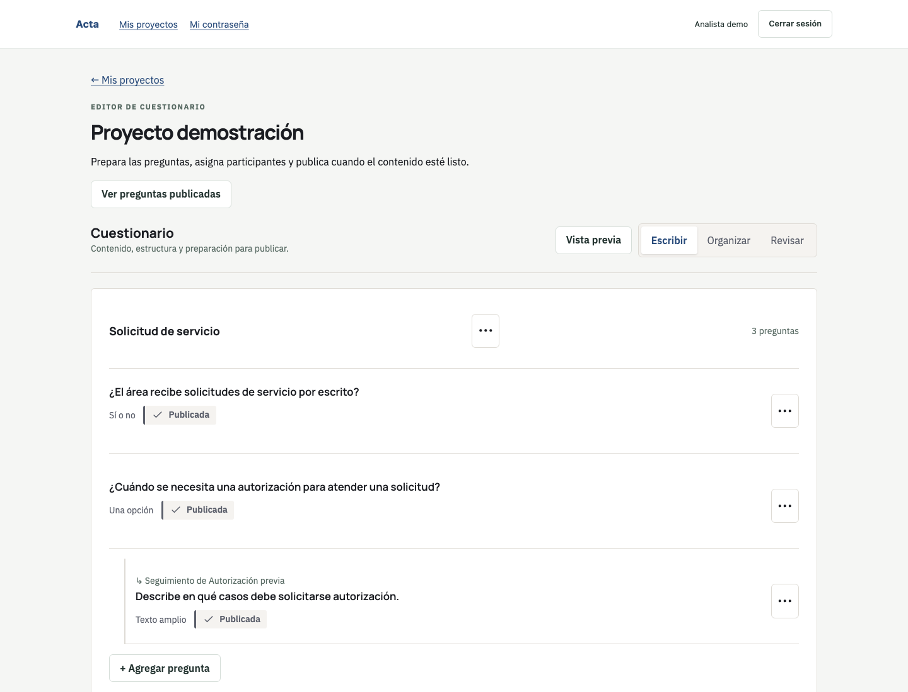
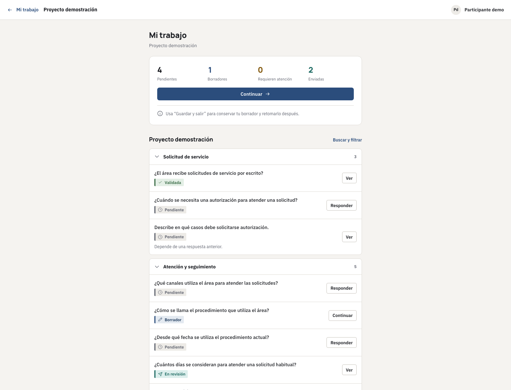
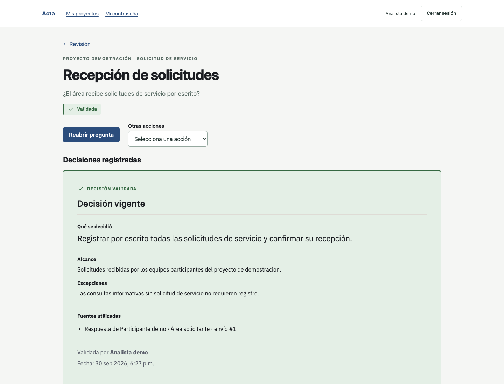

# Acta

**Questions. Evidence. Decisions.**

Acta es una plataforma open source para convertir preguntas estructuradas, conocimiento del equipo y evidencia en decisiones documentadas y trazables. Se instala dentro de tu propia infraestructura.


*Prepara un cuestionario por temas, con preguntas y seguimientos que se pueden leer de un vistazo.*

Autor y titular: **Cristóbal Ruz Escobar**. Copyright (c) Cristóbal Ruz Escobar. Licencia: **AGPL-3.0-only**; [texto íntegro](LICENSE). La publicación inicial sigue su revisión remota de seguridad.

## Qué problema resuelve

Cuando las respuestas están repartidas entre mensajes, archivos y personas, cuesta reconstruir qué se decidió y por qué. Acta reúne el cuestionario, las aportaciones, los adjuntos y las decisiones con sus fuentes.

El trabajo continúa después de recopilar respuestas: puedes pedir aclaraciones, comparar aportaciones diferentes y registrar una decisión validada con fuentes. Acta se centra en este recorrido de conocimiento y decisiones; no sustituye un issue tracker ni se limita a construir formularios. Resolver un conflicto y validar una decisión son operaciones distintas.

## Para quién sirve

- **Requerimientos de software:** un equipo ficticio consulta a quienes usarán un servicio y documenta las reglas que necesita implementar.
- **Procesos y políticas internas:** una organización de ejemplo reúne cómo se atienden solicitudes, identifica diferencias y registra el procedimiento acordado.
- **Decisiones entre áreas:** varios equipos aportan información y archivos para que un analista documente una decisión y sus fuentes.

## Cómo funciona

**Preparar → Asignar → Responder → Aclarar → Comparar → Decidir → Conservar fuentes y trazabilidad.**

El recorrido internacional se resume como: Prepare → Assign → Answer → Clarify → Compare → Decide → Trace.

No todas las preguntas necesitan aclaración o conflicto. Escribir, Organizar y Revisar son formas de trabajar sobre el mismo cuestionario. La vista previa no crea respuestas. Un borrador se puede retomar; enviar conserva una versión inmutable.

| Rol | Qué hace |
|---|---|
| Administrador | Prepara la instalación, usuarios, áreas, proyectos y accesos. Puede administrar el cuestionario. |
| Analista | Construye cuestionarios, asigna preguntas y revisa aportaciones; solicita aclaraciones, resuelve conflictos y registra decisiones. |
| Participante | Responde las preguntas que tiene asignadas, conserva borradores y aporta archivos y aclaraciones. |
| Lector | Consulta las decisiones vigentes y las fuentes que tiene permitido ver. |

Ser administrador no sustituye el rol de analista para validar decisiones. El área responsable no asigna personas automáticamente.

## Características principales

- Cuestionarios por temas, seguimientos y ocho tipos de respuesta, incluida matriz.
- Editor con vistas **Escribir**, **Organizar** y **Revisar antes de publicar**.
- **Mi trabajo** para participantes: borradores persistentes, envíos y evidencia privada.
- Aclaraciones, comparación de conflictos y decisiones validadas con fuentes identificables.
- Dashboard, trazabilidad, importación de estructura JSON y exportaciones JSON, CSV y Markdown según permisos.
- Historial de operaciones y acceso separado por proyecto.

## Quiero probarlo con datos ficticios

Necesitas Docker, Docker Compose **2.24.4 o posterior**, conexión para descargar imágenes/dependencias y espacio persistente. Plataforma verificada: **Linux ARM64**; Linux AMD64 todavía no verificado. No necesitas instalar Node ni PostgreSQL en tu equipo para este recorrido.

Usa un directorio y un proyecto Docker exclusivos para evaluación. No actives la demo sobre una instalación con datos reales.

1. Copia la configuración:

   ```sh
   cp .env.example .env
   ```

2. Edita `.env`: establece `DEMO_SEED=true` y una `DEMO_PASSWORD` privada, única, de al menos 20 caracteres. Puedes generarla con tu gestor de contraseñas. No compartas ni subas ese archivo.
3. Arranca la demo:

   ```sh
   docker compose -p requirements-demo up --build
   ```

4. Cuando los servicios estén saludables, abre [localhost:4317](http://localhost:4317). Puedes comprobar el estado desde otra terminal con `docker compose -p requirements-demo ps`.
5. Entra con `analyst` y la contraseña temporal de `.env`; cambia la contraseña cuando se solicite. Abre **Proyecto demostración**. Para probar la experiencia de participante, cierra sesión y entra con `stakeholder`, cambiando también su contraseña inicial.

La demo incluye usuarios ficticios `admin`, `analyst`, `stakeholder` y `viewer`, temas y preguntas. Las respuestas, conflictos y decisiones de las capturas ilustran operaciones realizadas después de crear la demo; no vienen todas precargadas. No ejecutes el bootstrap de administrador en esta demo: las cuentas ya existen.

Para detenerla conservando datos: `docker compose -p requirements-demo stop`. Para volver a iniciarla: `docker compose -p requirements-demo up -d --wait`. Mantén el mismo nombre de proyecto y `.env`. La instalación vacía siguiente es una alternativa, no un segundo paso de la demo.

## Quiero instalar una instancia vacía

En un directorio separado, copia `.env.example` a `.env` y conserva `DEMO_SEED=false`:

```sh
cp .env.example .env
docker compose up --build
```

Cuando los servicios estén saludables, crea el primer administrador desde otra terminal:

```sh
docker compose exec backend node scripts/bootstrap-admin.mjs
```

Introduce usuario, nombre visible y una contraseña temporal privada de al menos 20 caracteres. El primer acceso exige cambiarla. No existe una contraseña universal; repetir el bootstrap no restablece cuentas existentes.

Abre [localhost:4317](http://localhost:4317). Crea un proyecto desde **Administración → Proyectos** y agrega un tema y una pregunta desde **Escribir**. El formulario exige título breve e identificador externo; usa valores propios y conserva el identificador exactamente. Crea las áreas y usuarios necesarios, agrega miembros al proyecto, asigna participantes concretos y publica las preguntas. Después accede con el participante para responder y con un analista del proyecto para revisar.

Este arranque local no expone la aplicación a otras computadoras. Para un servidor y HTTPS, sigue [Self-hosting](docs/SELF-HOSTING.md). No borres volúmenes para actualizar o resolver errores.

## Self-hosting

El despliegue incluido usa **frontend + backend + PostgreSQL + VersityGW**, con trabajos de inicialización y migraciones.

- **PostgreSQL** guarda usuarios, proyectos, respuestas, decisiones y referencias a archivos.
- **VersityGW** guarda los archivos adjuntos en almacenamiento privado dentro de tu infraestructura, mediante la API S3. Es el proveedor self-hosted por defecto verificado.
- Los volúmenes Docker conservan datos y secretos entre reinicios. Un backup completo necesita base de datos, archivos y configuración; exportar JSON no sustituye ese backup.

[Instalar en servidor y actualizar](docs/SELF-HOSTING.md) · [Configuración](docs/CONFIGURATION.md) · [Backup y restauración](docs/BACKUP-RESTORE.md) · [Almacenamiento avanzado](docs/S3-PROVIDERS.md)

La interfaz usa fuentes y recursos locales, sin analytics ni CDN obligatorios. El build descarga dependencias públicas. Un almacenamiento externo recibe objetos únicamente si el operador lo configura. No se promete alta disponibilidad ni compatibilidad con cualquier endpoint S3.

Resultados y límites: [manifiesto de verificación](PUBLIC-SNAPSHOT-MANIFEST.md). No verificados: Linux AMD64, AWS S3, Ceph, SeaweedFS, multi-node/HA y migración entre proveedores. Recursos mínimos: **No published minimum yet.**

## Screenshots

Todas las imágenes proceden de datos ficticios. [Galería completa y procedencia](docs/assets/README.md).

| Participación | Decisiones con fuentes |
|---|---|
|  |  |
| Cada participante encuentra qué necesita atender. | La decisión conserva qué se acordó y qué aportaciones la sustentan. |

También puedes ver [Organizar](docs/assets/02-editor-organize.png), [Responder](docs/assets/04-answer.png), [Comparar un conflicto](docs/assets/05-conflict.png), [Dashboard](docs/assets/07-dashboard.png) y [Participante en móvil](docs/assets/08-participant-mobile.png).

## Open source y forks

Acta está diseñado para instalarse en infraestructura propia y adaptarse mediante forks. Las organizaciones pueden mantener personalizaciones y sincronizarse con el upstream conforme a AGPL-3.0-only. Las mejoras genéricas son bienvenidas de regreso mediante Pull Requests: contribuir así ayuda a otras instalaciones y reduce divergencia; no es una obligación de enviar PR atribuida a la licencia.

El upstream oficial es [github.com/ruzer/Acta](https://github.com/ruzer/Acta). La publicación de este snapshot y la habilitación de canales se registrarán después del gate remoto; no se presume que ya estén completadas.

[Gobernanza](GOVERNANCE.md) · [Forks y sincronización](docs/UPSTREAM-FORKS.md) · [Roadmap](ROADMAP.md) · [Soporte comunitario previsto](SUPPORT.md).

## Contribuir

La colaboración externa todavía no está abierta. Consulta [CONTRIBUTING](CONTRIBUTING.md) para el recorrido previsto, el mapa del repositorio y los requisitos de una contribución. Para preparar un entorno local: [Desarrollo](docs/DEVELOPMENT.md).

Destino previsto: **github.com/ruzer/Acta — PENDING UNTIL PUBLICATION**. [Issues previstos](https://github.com/ruzer/Acta/issues) — PENDING UNTIL PUBLICATION; no se afirma que este canal esté habilitado. La configuración real se verificará durante la fase de publicación.

[Documentación por audiencia](docs/README.md) · [Contratos por función](docs/CONTRACTS.md) · [Código de conducta](CODE_OF_CONDUCT.md) · [Cambios](CHANGELOG.md)

## Seguridad

Los errores normales irán al futuro issue tracker. Las vulnerabilidades necesitan un canal privado; no publiques detalles sensibles en un issue.

**PRIVATE SECURITY CONTACT — pending. PENDING BEFORE PUBLICATION.** Lee [SECURITY](SECURITY.md).

## Licencia

Acta is licensed under the GNU Affero General Public License v3.0.

**SPDX: AGPL-3.0-only.** Puedes utilizar, estudiar, modificar y redistribuir Acta conforme a [AGPL-3.0](LICENSE). La licencia no exige enviar Pull Requests a Acta. Los componentes de terceros conservan sus propias licencias y [avisos](docs/THIRD-PARTY-NOTICES.md).
