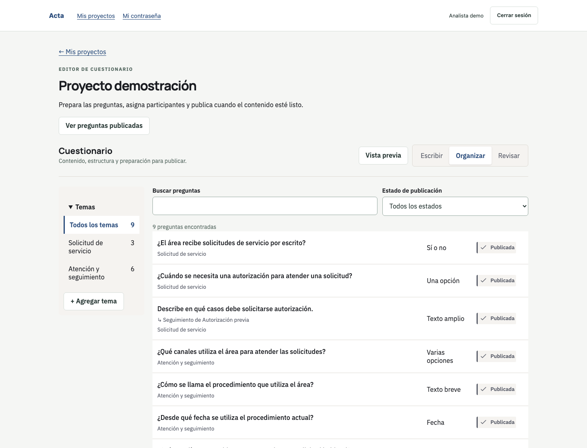
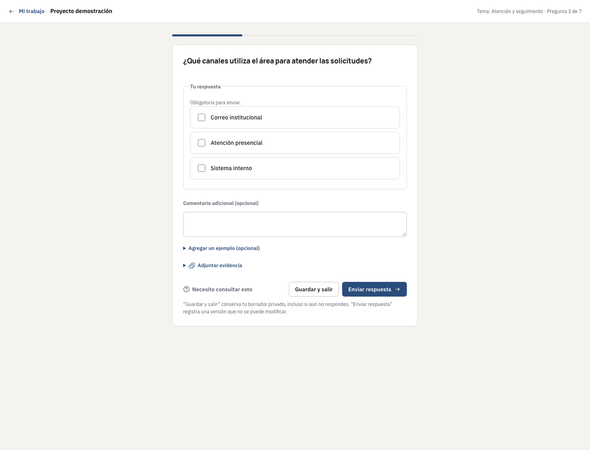
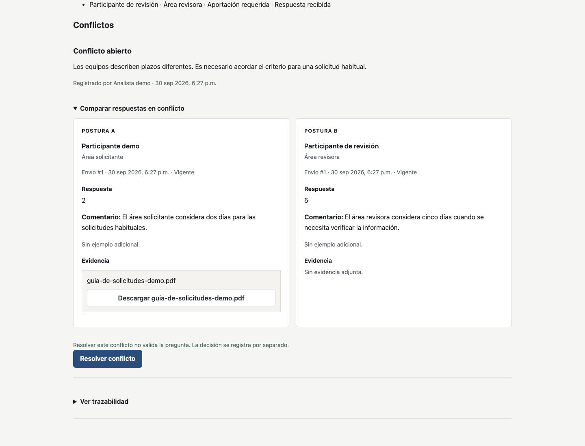
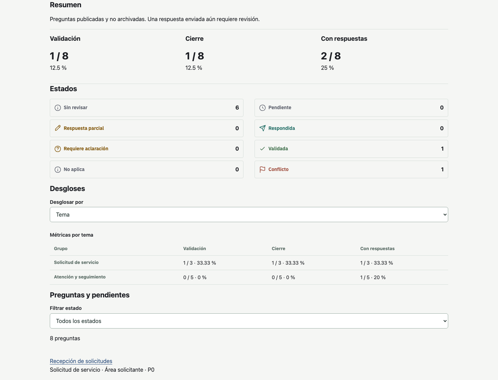
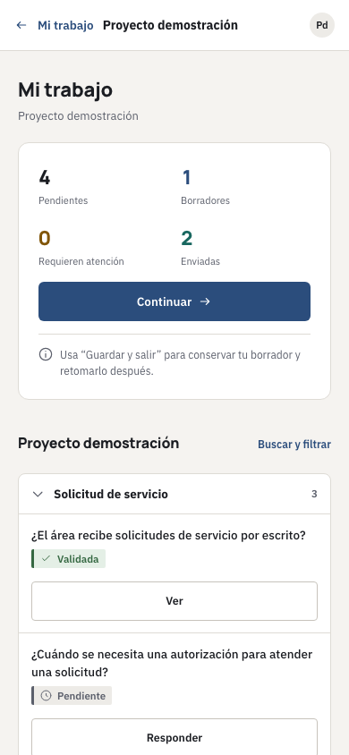

# Galería de Acta

**Procedencia: Generated from fictional demo data.** Capturas reales de Chromium sobre una instalación Docker nueva del snapshot, con volúmenes y credenciales propios, el 2026-09-30. No se usaron prototipos ni se alteró el DOM, los estilos o los estados para aparentar capacidades.

Las ocho capturas se regeneraron con branding **Acta**, conservando los mismos registros y estados ficticios. Los hashes de las 13 tablas de dominio comprobadas fueron idénticos antes y después de las capturas; no se alteraron respuestas, evidencia, conflicto ni decisión para esta actualización.

Historia ficticia: Proyecto demostración, recepción y atención de solicitudes de servicio. Participante demo y Participante de revisión aportan plazos distintos; Analista demo compara esas respuestas. La decisión sobre recepción por escrito utiliza una respuesta enviada y una guía PDF ficticia. Se creó además un borrador para mostrar continuidad de trabajo.

El seed incluye usuarios y preguntas; las respuestas, archivos, conflicto y decisión se crearon posteriormente mediante las operaciones reales. No se promete que una demo recién iniciada ya incluya todos esos resultados.

Resolución: **1440 × 1100** en escritorio, **390 × 844** en móvil, escala 1. PNG comprimido sin pérdida de píxeles; sin metadata personal ni marcos de navegador con rutas. En conflicto y dashboard se desplazó la página para encuadrar el contenido relevante. Estas imágenes públicas de producto no son artifacts de una auditoría ni sustituyen pruebas de accesibilidad.

## Escribir

El contenido del cuestionario se presenta por temas y seguimientos; agregar una pregunta mantiene su contexto.

## Organizar

La misma estructura puede buscarse y organizarse desde una vista compacta.

## Mi trabajo

El participante encuentra pendientes, borradores y envíos, con una acción para continuar.

## Responder

Una pregunta a la vez, comentario y evidencia opcionales, con guardar y enviar diferenciados.

## Comparar un conflicto

Dos respuestas sobre el plazo de atención aparecen en paralelo; resolver el conflicto no valida automáticamente la pregunta.

## Decisión validada

Qué se decidió, su alcance, excepciones, fuente, analista y fecha quedan identificados.

## Dashboard

El resumen muestra numeradores y denominadores reales de las preguntas publicadas de esta demo.

## Participante en móvil

La lista y sus acciones se adaptan a una pantalla estrecha.

Acta y sus capturas propias se distribuyen bajo [AGPL-3.0-only](../../LICENSE), según la decisión del titular. Los avisos de fuentes y otros componentes siguen en [THIRD-PARTY-NOTICES](../THIRD-PARTY-NOTICES.md).
